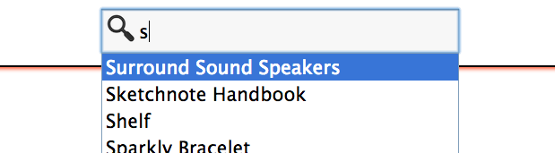

#Shoppr : Installation and User Manual

*You are to specify and construct HTML and PHP web-pages that support an easily-updated and customized "online shopping" capability for selling whatever kind of physical product your client wishes.* User accounts have been deliberately omitted; sales of digital goods and services are also omitted. Tested browsers: Chrome 26.0.1410.65, Safari 6.0.2 and Firefox 20.0.1. Built with: Apache 2.2.23, PHP 5.4.10, MySQL 5.5.29. No other versions have been tested.

##Installation

###Prerequisites 

MySQL username and password must be set to `root` and blank, respectively. If your MySQL username and password are different, please edit line 3 and 14 of `db/check_db.php` and line 3 of `db/connect_db.php`.

###Installation instructions

1. Copy `theshopcms` in its entirety to `htdocs` on your server or within your Apache/XAMPP/MAMP installation.
2. Visit the URL of the folder in your browser. (e.g. yourserver/theshopcms)
3. The database and required tables with be automatically created; sample data for products and orders will be inserted into the tables.

*NB: All references to `yourshop` herein refers to the specific domain or directory in which the product is installed.*

##Content management

###Adding, editing and deleting a product

To add a new product go to `yourshop/cms/add_product.php` or select 'add new product' from the CMS page. You will be presented with an image upload form. Choose the image you wish to use for the new product. Complete the form that is then show with the details of the new product and select 'submit'. If the product was added successfully a message will confirm this.

To edit or delete a product go to `yourshop/cms/edit.php` or select 'edit products' from the CMS page. To edit a product select 'edit' next to the specific product you wish to update. Modify the information in the form show, select 'submit' and a message will confirm the update.

To delete a product, select 'delete' next to the specific product you wish to delete. A message will confirm the deletion.

###Updating product stock levels

*NB: The update stock page requires you enter only the amount of **new** stock that has been delivered and not the total amount of stock.*

To update the stock level of a product go to `yourshop/cms/update_stock.php` or select 'update stock' from the CMS page. Choose the product you wish to update from the dropdown menu, type in the amount of stock that has been delivered and select 'update'. A message will confirm the update. 

##Administration

On the admin home page the first chart shows the current month’s sales per order. By selecting another month from the dropdown menu, the chart will adjust to show the selected month’s orders and sales. The second chart on the page shows the average delivery time based on all delivered orders and compares them to the industry average.

###Managing orders

*NB: Open orders refers to any order which has been placed but not delivered. Archived orders refers to those that have been delivered.*

To view open orders go to `yourshop/admin/open_orders.php` or select 'Open orders' from the Admin page. If the order has been delivered, select 'Mark as delivered' and the order will be archived. To view archived orders go to `yourshop/admin/archived_orders.php` or select 'Archived orders' from Admin page. For both open and archived orders, customer and order details can be viewed by selecting 'order details' next to the appropriate order.

###Site settings

Site settings can be found at `yourshop/admin/settings_site.php` or by selecting 'site settings' from the Admin page. Here you can the following elements: 

- **Site title** `default: Shoppr` This is the main title of your shop. It is displayed in the top left of all pages as well as applied to the `<title>` attribute.
- **Search placeholder text** `default: Search products` This is the text that is displayed as default in the search box on the main shopping pages.
- **Empty basket message** `default: Your basket is empty` This is the message that is displayed in the basket area (top right of shop pages) when there are no items in the basket.
- **Products per page** `default: 6` This is the number of products shown on each page.
- **Products per row** `default: 3` This is the number of products per row. Options are 2, 3 or 4.

###Appearance settings

Appearance settings can be found at `yourshop/admin/settings_appearance.php` or by selecting 'appearance settings' from the Admin page. Here the colours for the background, header, text, hyperlinks and product border can be changed. Three themes are also installed and can be used by pressing the corresponding ‘switch’ button.

#Shoppr : Final Specification and Rationale

##Shop
`/index.php`

**View all products and browse by category:** Ability to view all products and organise them by category.

**Search products:** Ability to search for products (name, description, category) based on search terms, with partial word matching. Suggestions are shown based on product titles in compatible browsers. By implementing this, the customer will be more likely to find the specific products they are looking for.

**Sorting of products:** All multiple product views (all, category, search) can be sorted by name, price and stock level. Sorting of products allows customers to find what they are looking for faster.

**Add to basket**: Items can be added to the basket from all product views and stock levels are checked on addition to avoid over-ordering.

**Basket summary and basket/checkout page:** The first five items in the basket can be viewed in the basket summary. This is to allow customers to get a quick overview of their basket without having to visit another page. Basket item quantities can be modified and are checked against stock levels to avoid errors. Checkout is integrated with the basket page for ease of use.

**Individual product pages and related items:** Each product has its own product page and related items are shown at the bottom of the page. These pages allow the customer to see a full description of the product and related items might suggest a product they had not seen yet, which in turn would increase sales.

**Pagination:** Product views with multiple items are split up into separate pages and can be navigated via the arrows (and numbered links) at the top of the page. By implementing this pages will load faster therefore making the experience better for the customer.

**Order tracking:** Customers can check if their order has been delivered using their order ID and email address. This reduces the amount of support email customers send, as they can confirm the status of their order instantly.

**Out of stock message:** On selection of the 'out of stock' button, a user can input their email address and be notified when the product is back in stock. This reassures the customer that they will be able to buy the product and also reduces the risk of the customers looking for the product on another shop.

##CMS
`/cms`

**Add new product:** New products can be added including a product image. 

**Edit, delete and update stock:** Information about a product can be edited or deleted and new stock can be added to a product. This is implemented to make product management as easy as possible. 

**Summary of products:** This overview shows the user a simple overview of the products they have and which have low or high stock levels. This is to give the user an easy way to foresee problems with stock levels.

##Admin
`/admin`

**Popular products, monthly sales and average delivery time chart:** These charts show information on monthly sales (which the user can select) and the average delivery time based on the industry average. These give the user an easy-to-read overview of how the shop is doing.

**Order management:** The user can mark orders as delivered and view the details of those orders. This gives an overview of orders that have yet to be delivered.

**Low stock products:** This shows any products that have a stock level of less than 50. The user can edit or delete products from this view and it also allows them to see which products need reordering.

**Site/appearance settings and themes.:** These are the site-wide settings for the website. The user can modify the title, layout or product views and colours. The user can also choose from a selection of pre-installed themes. These allow the user to customise the site easily with limited assumed knowledge.

#Shoppr : Final Project Report

##Lifecycle and scheduling

As outlined in my initial interim report, I used the three-way methodology which involves creating and continually testing a feature until it is working as required. This work particularly well as many of the features work independently of each other and didn't cause issues with other parts of the site when implemented. In combination with this, the entire project was tracked using Git versioning and GitHub. On three occasions, due to erroneous changes I was forced to revert back to a previous commit, which is something I had not had to do on previous projects. By using Git I have learnt a number of new commands for managing Git repositories including `$ git reset` and, even more so `$ git log`, which I have learnt how to use to customise the output of the commit log, useful for tracking progress.

Although I tried to plan to the best of my ability, there were many issues that I faced during development and many aspects took much longer than expected. Because of this, the last few weeks of development were much more work intensive than I had initially planned. Features that I hadn't planned for, but which I felt were required for the project to be successful, needed to be developed. This happened for a number of reasons. My relatively small knowledge of PHP and Javascript (at the beginning of the project) made it difficult to accurately allocate time to implement features. Also, during the process of building a feature, I found that changes had to be made to core components, such as table fields, to make the feature work in the most effective way.

##Surprises and lessons learnt

After completion of the pagination feature, the product sort function still worked as designed. However, if used on a page other that page one it would always reset to page one on sorting. I initially thought this was not how it should work and spent approximately three hours trying to get it to remember the current page and products. However, after I couldn't get it to work correctly, I looked at other commerce sites (e.g. Amazon) and noticed that they all reset to the first page on sorting. If I had researched how pagination and sorting is implemented on other commerce sites first, I would have saved myself time and been able to work on other features. In the future I will research features more carefully before trying to implement them.

During the development of the monthly sales chart function I tried to implement an Ajax request to get any given month's sales data and redraw the chart. After spending a couple of hours trying to get it to work, I began to understand how Javascript is interpreted by the browser. Due to the nature of Javascript, redrawing the chart would require either an iFrame or a full reload of the page, which I did not want to implement as it is not the optimum experience for the user. After some research, I found the jQuery.load() function, which allows the content of another page to be loaded within an element. I now understand how Javascript is interpreted by the browser and will be able to implement much more efficient dynamic content in the future.

As these experiences show, planning is of utmost importance when working on a project of this size. Another issue that I faced was deciding exactly when the project was in a "finished" state. Because the scope of the project wasn't specific enough about the features, each time I added a feature I thought of another one to compliment or improve it. Towards the last couple of weeks of the project, I forced myself to simply make a note of extra features I thought of, with a view to implement them after the deadline. In future projects, I will be sure to create a much more specific scope at the beginning of a project and to work only within that scope. 

##Future plans

In the future, I plan to continue development of the system, fixes the issues mentioned above as well as implement more features (see “Feature Roadmap”). The project is of a high enough complexity that each new feature allows me to learn about a new aspect of a language, for example, PHP. When the project is up to a standard I am happy with and feature complete (to the point it could be used in a real-world scenario), I plan to open-source it and collaborate with other developers to improve the system.

##Feature Roadmap

These are the features I plan to implement before open-sourcing the project.

- Optimise MySQL queries
- Setup process for input of settings
- Installable themes
- Customisable layouts
- Product sizes/variations for clothing products
- Multiple product images
- Fallback for users with Javascript disabled
- Implement payment system such as Paypal or Stripe

#Shoppr : References and Resources

##References

Burgess, A. (2011, July 25). Uploading Files with AJAX. *Net Tuts+.* Retrieved from [http://net.tutsplus.com/tutorials/javascript-ajax/uploading-files-with-ajax/](http://net.tutsplus.com/tutorials/javascript-ajax/uploading-files-with-ajax/)

*JSColor - JavaScript / HTML Color Picker, Selector, Chooser*. (2008). [http://jscolor.com/](http://jscolor.com/)

McGrath, M. (2012). *PHP and MySQL In Easy Steps.* (4th ed.). London: In Easy Steps.

##Resources

Kitamura, E. (2013). Datalist Experiment. *Eiji Kitamura Demos.* Retrieved from [http://demo.agektmr.com/datalist/](http://demo.agektmr.com/datalist/)

Simone, T. D. (2012, March 2). HTML5 input type=number and decimals/floats in Chrome. *Isotoma Blog.* Retrieved from [http://blog.isotoma.com/2012/03/html5-input-typenumber-and-decimalsfloats-in-chrome/](http://blog.isotoma.com/2012/03/html5-input-typenumber-and-decimalsfloats-in-chrome/)

Ingram. T. (2006, December 28). Basic PHP and MySQL Pagination Tutorial. *TYLER INGRAM dot COM*. Retrieved from [http://www.tyleringram.com/blog/basic-php-and-mysql-pagination-tutorial](http://www.tyleringram.com/blog/basic-php-and-mysql-pagination-tutorial)

*4.10 Forms — HTML Standard*. (2013). Retrieved from [http://www.whatwg.org/specs/web-apps/current-work/multipage/forms.html#client-side-form-validation](http://www.whatwg.org/specs/web-apps/current-work/multipage/forms.html#client-side-form-validation)

*MySQL DATEDIFF() function*. (2010).[http://www.w3resource.com/mysql/date-and-time-functions/mysql-datediff-function.php](http://www.w3resource.com/mysql/date-and-time-functions/mysql-datediff-function.php)

*Can I Use...Datalist Element.* (2013). Retrieved from [http://caniuse.com/#feat=datalist](http://caniuse.com/#feat=datalist)

*11.7. Date and Time Functions*. (2006). [https://dev.mysql.com/doc/refman/4.1/en/date-and-time-functions.html](https://dev.mysql.com/doc/refman/4.1/en/date-and-time-functions.html)

*php - How to post two values in an option field?*. (2011). [http://stackoverflow.com/questions/8027163/how-to-post-two-values-in-an-option-field](http://stackoverflow.com/questions/8027163/how-to-post-two-values-in-an-option-field)

*CSS Colors: Take Control Using PHP*. (2006). [http://www.barelyfitz.com/projects/csscolor/](http://www.barelyfitz.com/projects/csscolor/)

*DocToc*. (2013). Retrieved from [http://doctoc.herokuapp.com/](http://doctoc.herokuapp.com/)

